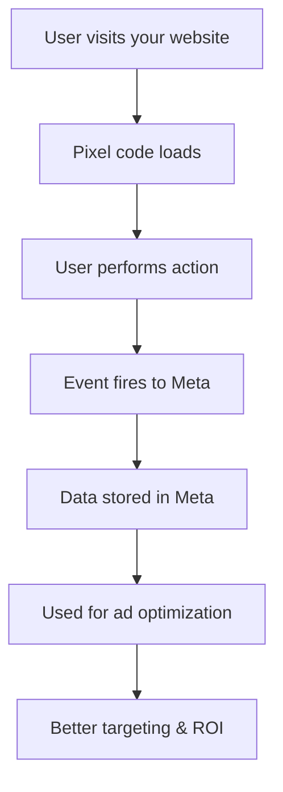

# Lesson 1: Basics of Meta Pixel (Facebook & Instagram)

## 🎯 Learning Objectives

By the end of this lesson, you will understand:
- What Meta Pixel is and how it works
- The difference between Facebook and Instagram Pixels
- Benefits of pixel tracking for e-commerce
- Privacy considerations and GDPR compliance
- How pixel data improves ad targeting

## 📖 What is Meta Pixel?

Meta Pixel (formerly Facebook Pixel) is a piece of JavaScript code that you place on your website to track visitor behavior and interactions. It helps you:

- **Measure ad effectiveness**: See which ads lead to conversions
- **Build custom audiences**: Create targeted audiences based on website visitors
- **Optimize ad delivery**: Help Facebook show your ads to people more likely to convert
- **Track conversions**: Measure the success of your marketing campaigns

## 🔍 Facebook vs Instagram Pixel

### Facebook Pixel
- Tracks user behavior on your website
- Used for Facebook ad optimization
- Provides detailed analytics and insights
- Enables retargeting campaigns

### Instagram Pixel
- **Important**: Instagram uses the same pixel as Facebook
- No separate Instagram pixel exists
- One pixel works for both Facebook and Instagram ads
- Instagram ads use Facebook's advertising platform

## 🛒 How Pixel Tracking Works



### Key Components:

1. **Base Code**: Core tracking script
2. **Events**: Specific actions (page views, purchases, etc.)
3. **Parameters**: Additional data (product info, value, etc.)
4. **Cookies**: Store user information (with consent)

## 📊 E-commerce Events You Can Track

### Standard Events
- **PageView**: User visits a page
- **ViewContent**: User views a product
- **AddToCart**: User adds item to cart
- **InitiateCheckout**: User starts checkout
- **Purchase**: User completes purchase
- **Lead**: User submits contact form

### Custom Events
- **Newsletter Signup**: User subscribes to newsletter
- **Video Play**: User watches product video
- **Search**: User searches for products
- **AddToWishlist**: User saves item for later

## 🔒 Privacy and GDPR Considerations

### Cookie Consent
```javascript
// Example: Only load pixel after consent
if (userConsent === 'accepted') {
  // Load Facebook Pixel
  fbq('init', 'YOUR_PIXEL_ID');
}
```

### Data Protection Requirements
- **Transparency**: Inform users about tracking
- **Consent**: Get explicit consent before tracking
- **Data minimization**: Only collect necessary data
- **User rights**: Allow users to opt-out

### Best Practices
1. **Cookie Banner**: Implement clear consent mechanism
2. **Privacy Policy**: Update to include pixel tracking
3. **Opt-out Options**: Provide easy way to disable tracking
4. **Data Retention**: Set appropriate retention periods

## 💡 Benefits for E-commerce

### 1. Improved Ad Targeting
- **Lookalike Audiences**: Find users similar to your customers
- **Retargeting**: Show ads to previous visitors
- **Dynamic Product Ads**: Show relevant products automatically

### 2. Better Conversion Tracking
- **Attribution**: See which ads drive sales
- **ROI Measurement**: Calculate return on ad spend
- **Funnel Analysis**: Understand user journey

### 3. Enhanced User Experience
- **Personalized Ads**: Show relevant products
- **Cross-device Tracking**: Consistent experience across devices
- **Frequency Capping**: Avoid ad fatigue

## 🎯 Real-World Example

Imagine you run an online clothing store:

1. **User visits** your homepage → `PageView` event
2. **User browses** a product page → `ViewContent` event
3. **User adds** item to cart → `AddToCart` event
4. **User starts** checkout → `InitiateCheckout` event
5. **User completes** purchase → `Purchase` event

Meta uses this data to:
- Find similar users for your ads
- Optimize ad delivery for conversions
- Measure campaign performance
- Create retargeting audiences

## 📝 Key Takeaways

- Meta Pixel tracks user behavior on your website
- Facebook and Instagram use the same pixel
- Pixel data improves ad targeting and ROI
- Privacy compliance is essential
- E-commerce events provide valuable insights

## 🚀 Next Steps

In the next lesson, we'll set up your Meta Business account and generate your Pixel ID.

---

**Ready for Lesson 2?** [Generate Pixel ID and Setup in Meta Business Suite →](./lesson-2-setup.md)
