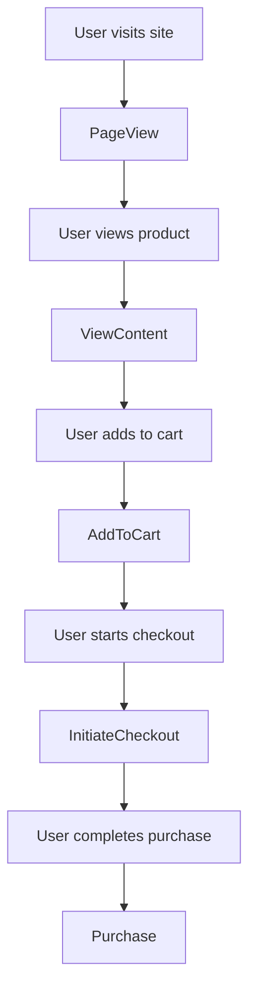

# Lesson 4: Track Page Views, Add-to-Cart, and Purchase Events

## 🎯 Learning Objectives

By the end of this lesson, you will be able to:
- Implement automatic page view tracking
- Track product view events
- Handle add-to-cart events
- Implement purchase tracking
- Set up checkout flow tracking
- Use proper event parameters

## 📊 E-commerce Event Overview

### Standard E-commerce Events



## 🔍 Page View Tracking

### Automatic Page Views

```typescript
// components/PageViewTracker.tsx
'use client';

import { useEffect } from 'react';
import { usePixel } from '@/components/PixelProvider';
import { usePathname } from 'next/navigation';

export default function PageViewTracker() {
  const { trackEvent } = usePixel();
  const pathname = usePathname();

  useEffect(() => {
    // Track page view on route change
    trackEvent('PageView', {
      page_title: document.title,
      page_location: window.location.href,
      page_path: pathname
    });
  }, [pathname, trackEvent]);

  return null;
}
```

### Manual Page View Tracking

```typescript
// For specific pages or custom tracking
const handlePageView = () => {
  trackEvent('PageView', {
    page_title: 'Product Category - Electronics',
    page_category: 'Electronics',
    page_location: window.location.href
  });
};
```

## 🛍️ Product View Tracking

### Product Page Component

```typescript
// components/ProductPage.tsx
'use client';

import { useEffect } from 'react';
import { usePixel } from '@/components/PixelProvider';

interface Product {
  id: string;
  name: string;
  price: number;
  category: string;
  currency: string;
}

interface ProductPageProps {
  product: Product;
}

export default function ProductPage({ product }: ProductPageProps) {
  const { trackViewContent } = usePixel();

  useEffect(() => {
    // Track product view when component mounts
    trackViewContent(
      product.id,
      product.price,
      product.currency
    );
  }, [product, trackViewContent]);

  return (
    <div className="max-w-4xl mx-auto p-6">
      <h1 className="text-3xl font-bold mb-4">{product.name}</h1>
      <p className="text-2xl text-green-600 mb-4">
        ${product.price} {product.currency}
      </p>
      <p className="text-gray-600 mb-6">Category: {product.category}</p>
      
      {/* Product details */}
    </div>
  );
}
```

### Enhanced Product Tracking

```typescript
// Enhanced product view with more parameters
const trackProductView = (product: Product) => {
  trackEvent('ViewContent', {
    content_ids: [product.id],
    content_type: 'product',
    content_name: product.name,
    content_category: product.category,
    value: product.price,
    currency: product.currency
  });
};
```

## 🛒 Add to Cart Tracking

### Add to Cart Component

```typescript
// components/AddToCartButton.tsx
'use client';

import { useState } from 'react';
import { usePixel } from '@/components/PixelProvider';

interface AddToCartButtonProps {
  product: {
    id: string;
    name: string;
    price: number;
    currency: string;
    category: string;
  };
  onAddToCart: (product: any) => void;
}

export default function AddToCartButton({ product, onAddToCart }: AddToCartButtonProps) {
  const { trackAddToCart } = usePixel();
  const [isAdding, setIsAdding] = useState(false);

  const handleAddToCart = async () => {
    setIsAdding(true);
    
    try {
      // Add to cart logic
      await onAddToCart(product);
      
      // Track the event
      trackAddToCart(product.price, product.currency, {
        content_ids: [product.id],
        content_type: 'product',
        content_name: product.name,
        content_category: product.category,
        num_items: 1
      });
      
    } catch (error) {
      console.error('Failed to add to cart:', error);
    } finally {
      setIsAdding(false);
    }
  };

  return (
    <button
      onClick={handleAddToCart}
      disabled={isAdding}
      className="w-full bg-blue-500 text-white py-3 px-6 rounded-lg hover:bg-blue-600 disabled:opacity-50"
    >
      {isAdding ? 'Adding...' : 'Add to Cart'}
    </button>
  );
}
```

### Cart Management Hook

```typescript
// hooks/useCart.ts
import { useState, useEffect } from 'react';
import { usePixel } from '@/components/PixelProvider';

interface CartItem {
  id: string;
  name: string;
  price: number;
  quantity: number;
  currency: string;
}

export function useCart() {
  const [cart, setCart] = useState<CartItem[]>([]);
  const { trackAddToCart } = usePixel();

  const addToCart = (product: Omit<CartItem, 'quantity'>) => {
    setCart(prevCart => {
      const existingItem = prevCart.find(item => item.id === product.id);
      
      if (existingItem) {
        // Update quantity
        const updatedCart = prevCart.map(item =>
          item.id === product.id
            ? { ...item, quantity: item.quantity + 1 }
            : item
        );
        
        // Track add to cart event
        trackAddToCart(product.price, product.currency, {
          content_ids: [product.id],
          content_type: 'product',
          content_name: product.name,
          value: product.price,
          currency: product.currency
        });
        
        return updatedCart;
      } else {
        // Add new item
        const newCart = [...prevCart, { ...product, quantity: 1 }];
        
        // Track add to cart event
        trackAddToCart(product.price, product.currency, {
          content_ids: [product.id],
          content_type: 'product',
          content_name: product.name,
          value: product.price,
          currency: product.currency
        });
        
        return newCart;
      }
    });
  };

  const removeFromCart = (productId: string) => {
    setCart(prevCart => prevCart.filter(item => item.id !== productId));
  };

  const getTotalValue = () => {
    return cart.reduce((total, item) => total + (item.price * item.quantity), 0);
  };

  return {
    cart,
    addToCart,
    removeFromCart,
    getTotalValue
  };
}
```

## 💳 Checkout Flow Tracking

### Initiate Checkout

```typescript
// components/CheckoutButton.tsx
'use client';

import { usePixel } from '@/components/PixelProvider';

interface CheckoutButtonProps {
  cart: CartItem[];
  onCheckout: () => void;
}

export default function CheckoutButton({ cart, onCheckout }: CheckoutButtonProps) {
  const { trackInitiateCheckout } = usePixel();

  const handleCheckout = () => {
    const totalValue = cart.reduce((total, item) => total + (item.price * item.quantity), 0);
    const contentIds = cart.map(item => item.id);
    
    // Track initiate checkout
    trackInitiateCheckout(totalValue, 'USD', {
      content_ids: contentIds,
      content_type: 'product',
      num_items: cart.reduce((total, item) => total + item.quantity, 0)
    });
    
    onCheckout();
  };

  return (
    <button
      onClick={handleCheckout}
      className="w-full bg-green-500 text-white py-3 px-6 rounded-lg hover:bg-green-600"
    >
      Proceed to Checkout
    </button>
  );
}
```

### Checkout Page Component

```typescript
// app/checkout/page.tsx
'use client';

import { useEffect } from 'react';
import { usePixel } from '@/components/PixelProvider';

export default function CheckoutPage() {
  const { trackEvent } = usePixel();

  useEffect(() => {
    // Track checkout page view
    trackEvent('InitiateCheckout', {
      page_title: 'Checkout',
      page_location: window.location.href
    });
  }, [trackEvent]);

  return (
    <div className="max-w-2xl mx-auto p-6">
      <h1 className="text-2xl font-bold mb-6">Checkout</h1>
      {/* Checkout form */}
    </div>
  );
}
```

## 🎯 Purchase Tracking

### Purchase Completion

```typescript
// components/PurchaseConfirmation.tsx
'use client';

import { useEffect } from 'react';
import { usePixel } from '@/components/PixelProvider';

interface PurchaseData {
  orderId: string;
  value: number;
  currency: string;
  items: Array<{
    id: string;
    name: string;
    quantity: number;
    price: number;
  }>;
}

interface PurchaseConfirmationProps {
  purchaseData: PurchaseData;
}

export default function PurchaseConfirmation({ purchaseData }: PurchaseConfirmationProps) {
  const { trackPurchase } = usePixel();

  useEffect(() => {
    // Track purchase event
    trackPurchase(purchaseData.value, purchaseData.currency, {
      content_ids: purchaseData.items.map(item => item.id),
      content_type: 'product',
      content_name: purchaseData.items.map(item => item.name),
      num_items: purchaseData.items.reduce((total, item) => total + item.quantity, 0),
      order_id: purchaseData.orderId
    });
  }, [purchaseData, trackPurchase]);

  return (
    <div className="max-w-2xl mx-auto p-6">
      <h1 className="text-2xl font-bold text-green-600 mb-4">
        Purchase Complete!
      </h1>
      <p>Order ID: {purchaseData.orderId}</p>
      <p>Total: ${purchaseData.value} {purchaseData.currency}</p>
    </div>
  );
}
```

### Payment Processing Integration

```typescript
// lib/payment.ts
import { getFacebookPixel } from '@/lib/facebook-pixel';

export async function processPayment(
  paymentData: any,
  cartItems: CartItem[]
): Promise<{ success: boolean; orderId?: string }> {
  try {
    // Process payment with your payment provider
    const paymentResult = await fetch('/api/payment', {
      method: 'POST',
      headers: { 'Content-Type': 'application/json' },
      body: JSON.stringify(paymentData)
    });

    if (paymentResult.ok) {
      const { orderId } = await paymentResult.json();
      
      // Track purchase event
      const pixel = getFacebookPixel();
      if (pixel) {
        const totalValue = cartItems.reduce((total, item) => total + (item.price * item.quantity), 0);
        
        pixel.trackPurchase(totalValue, 'USD', {
          content_ids: cartItems.map(item => item.id),
          content_type: 'product',
          num_items: cartItems.reduce((total, item) => total + item.quantity, 0),
          order_id: orderId
        });
      }
      
      return { success: true, orderId };
    }
    
    return { success: false };
  } catch (error) {
    console.error('Payment processing failed:', error);
    return { success: false };
  }
}
```

## 🔄 Event Flow Implementation

### Complete E-commerce Flow

```typescript
// components/EcommerceFlow.tsx
'use client';

import { useState } from 'react';
import { usePixel } from '@/components/PixelProvider';
import { useCart } from '@/hooks/useCart';

export default function EcommerceFlow() {
  const { trackEvent } = usePixel();
  const { cart, addToCart, getTotalValue } = useCart();
  const [currentStep, setCurrentStep] = useState<'browse' | 'cart' | 'checkout' | 'complete'>('browse');

  const products = [
    { id: '1', name: 'Laptop', price: 999.99, currency: 'USD' },
    { id: '2', name: 'Mouse', price: 29.99, currency: 'USD' },
    { id: '3', name: 'Keyboard', price: 79.99, currency: 'USD' }
  ];

  const handleViewProduct = (product: any) => {
    trackEvent('ViewContent', {
      content_ids: [product.id],
      content_type: 'product',
      content_name: product.name,
      value: product.price,
      currency: product.currency
    });
  };

  const handleAddToCart = (product: any) => {
    addToCart(product);
    setCurrentStep('cart');
  };

  const handleCheckout = () => {
    trackEvent('InitiateCheckout', {
      content_ids: cart.map(item => item.id),
      content_type: 'product',
      value: getTotalValue(),
      currency: 'USD',
      num_items: cart.reduce((total, item) => total + item.quantity, 0)
    });
    setCurrentStep('checkout');
  };

  const handlePurchase = () => {
    const orderId = `ORDER_${Date.now()}`;
    
    trackEvent('Purchase', {
      content_ids: cart.map(item => item.id),
      content_type: 'product',
      value: getTotalValue(),
      currency: 'USD',
      num_items: cart.reduce((total, item) => total + item.quantity, 0),
      order_id: orderId
    });
    
    setCurrentStep('complete');
  };

  return (
    <div className="max-w-4xl mx-auto p-6">
      {currentStep === 'browse' && (
        <div>
          <h1 className="text-2xl font-bold mb-6">Products</h1>
          <div className="grid grid-cols-1 md:grid-cols-3 gap-6">
            {products.map(product => (
              <div key={product.id} className="border rounded-lg p-4">
                <h3 className="font-semibold">{product.name}</h3>
                <p className="text-green-600">${product.price}</p>
                <button
                  onClick={() => handleViewProduct(product)}
                  className="text-blue-500 hover:underline"
                >
                  View Details
                </button>
                <button
                  onClick={() => handleAddToCart(product)}
                  className="w-full mt-2 bg-blue-500 text-white py-2 rounded"
                >
                  Add to Cart
                </button>
              </div>
            ))}
          </div>
        </div>
      )}

      {currentStep === 'cart' && (
        <div>
          <h1 className="text-2xl font-bold mb-6">Shopping Cart</h1>
          <div className="space-y-4">
            {cart.map(item => (
              <div key={item.id} className="flex justify-between items-center border p-4 rounded">
                <span>{item.name} x {item.quantity}</span>
                <span>${(item.price * item.quantity).toFixed(2)}</span>
              </div>
            ))}
            <div className="text-xl font-bold">
              Total: ${getTotalValue().toFixed(2)}
            </div>
            <button
              onClick={handleCheckout}
              className="w-full bg-green-500 text-white py-3 rounded-lg"
            >
              Proceed to Checkout
            </button>
          </div>
        </div>
      )}

      {currentStep === 'checkout' && (
        <div>
          <h1 className="text-2xl font-bold mb-6">Checkout</h1>
          <div className="space-y-4">
            <div>
              <label className="block text-sm font-medium">Email</label>
              <input type="email" className="w-full border rounded p-2" />
            </div>
            <div>
              <label className="block text-sm font-medium">Card Number</label>
              <input type="text" className="w-full border rounded p-2" />
            </div>
            <button
              onClick={handlePurchase}
              className="w-full bg-blue-500 text-white py-3 rounded-lg"
            >
              Complete Purchase
            </button>
          </div>
        </div>
      )}

      {currentStep === 'complete' && (
        <div className="text-center">
          <h1 className="text-2xl font-bold text-green-600 mb-4">
            Purchase Complete!
          </h1>
          <p>Thank you for your purchase!</p>
        </div>
      )}
    </div>
  );
}
```

## 📊 Event Parameters Reference

### Standard Parameters

```typescript
interface StandardEventParams {
  value?: number;           // Monetary value
  currency?: string;        // Currency code (USD, EUR, etc.)
  content_ids?: string[];   // Product IDs
  content_type?: string;    // 'product', 'product_group'
  content_name?: string;    // Product name
  content_category?: string; // Product category
  num_items?: number;       // Number of items
  order_id?: string;        // Order/transaction ID
}
```

### Custom Parameters

```typescript
// You can add custom parameters for your business needs
const customParams = {
  customer_type: 'new',     // new, returning
  discount_code: 'SAVE10',  // Applied discount
  shipping_method: 'express', // Shipping option
  payment_method: 'credit_card' // Payment method
};
```

## 🧪 Testing Your Events

### Development Testing

```typescript
// Add to your component for testing
useEffect(() => {
  if (process.env.NODE_ENV === 'development') {
    console.log('Current cart:', cart);
    console.log('Total value:', getTotalValue());
  }
}, [cart]);
```

### Event Verification

1. **Check Network Tab**: Look for Facebook requests
2. **Use Meta Pixel Helper**: Verify events in browser
3. **Events Manager**: Check real-time events

## 📋 Checklist

Before moving to the next lesson, ensure you have:

- ✅ Page view tracking implemented
- ✅ Product view events working
- ✅ Add to cart functionality
- ✅ Checkout flow tracking
- ✅ Purchase completion tracking
- ✅ All events firing correctly

## 🚀 Next Steps

In the next lesson, we'll learn how to debug and verify your pixel implementation.

---

**Ready for Lesson 5?** [Debugging and Verifying Pixel with Meta Pixel Helper →](./lesson-5-debugging.md)
