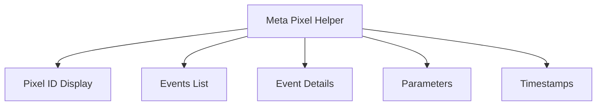

# Lesson 5: Debugging and Verifying Pixel with Meta Pixel Helper

## 🎯 Learning Objectives

By the end of this lesson, you will be able to:
- Install and use Meta Pixel Helper
- Debug pixel implementation issues
- Verify events are firing correctly
- Troubleshoot common problems
- Use browser developer tools for pixel debugging
- Implement proper error handling

## 🔧 Meta Pixel Helper Installation

### Step 1: Install Browser Extension

**Chrome/Edge:**
1. Go to [Chrome Web Store](https://chrome.google.com/webstore/detail/meta-pixel-helper/fdgfkebogiimcoedlicjlajpkdmockpc)
2. Click "Add to Chrome"
3. Pin the extension to your toolbar

**Firefox:**
1. Go to [Firefox Add-ons](https://addons.mozilla.org/en-US/firefox/addon/meta-pixel-helper/)
2. Click "Add to Firefox"
3. Pin the extension to your toolbar

### Step 2: Verify Installation

1. **Open** your website with pixel installed
2. **Click** the Meta Pixel Helper icon
3. **Check** if your pixel ID appears
4. **Verify** events are being tracked

## 🔍 Using Meta Pixel Helper

### Understanding the Interface



### Key Features

1. **Pixel Detection**: Shows if pixel is loaded
2. **Event Tracking**: Lists all fired events
3. **Parameter Inspection**: View event data
4. **Real-time Monitoring**: Live event updates
5. **Error Detection**: Identifies issues

### Reading the Helper

```typescript
// What you'll see in the helper:
{
  "pixel_id": "123456789012345",
  "events": [
    {
      "event_name": "PageView",
      "timestamp": "2024-01-15T10:30:00Z",
      "parameters": {
          "page_title": "Home Page",
          "page_location": "https://mystore.com"
      }
    }
  ]
}
```

## 🐛 Common Debugging Scenarios

### Scenario 1: Pixel Not Loading

**Symptoms:**
- Meta Pixel Helper shows "No pixel detected"
- No Facebook requests in Network tab
- Console errors

**Debugging Steps:**

```typescript
// 1. Check if pixel ID is set
console.log('Pixel ID:', process.env.NEXT_PUBLIC_FACEBOOK_PIXEL_ID);

// 2. Verify pixel initialization
useEffect(() => {
  console.log('Window fbq available:', typeof window.fbq);
  console.log('Pixel initialized:', window.fbq && window.fbq.callMethod);
}, []);

// 3. Check for JavaScript errors
window.addEventListener('error', (error) => {
  console.error('JavaScript error:', error);
});
```

**Solutions:**

```typescript
// Ensure pixel ID is properly set
const pixelId = process.env.NEXT_PUBLIC_FACEBOOK_PIXEL_ID;
if (!pixelId) {
  console.error('Facebook Pixel ID not found in environment variables');
  return;
}

// Add error handling to pixel loading
const script = document.createElement('script');
script.src = 'https://connect.facebook.net/en_US/fbevents.js';
script.onerror = () => {
  console.error('Failed to load Facebook Pixel script');
};
script.onload = () => {
  console.log('Facebook Pixel script loaded successfully');
  window.fbq('init', pixelId);
};
```

### Scenario 2: Events Not Firing

**Symptoms:**
- Pixel loads but no events appear
- Events fire but don't show in helper
- Inconsistent event tracking

**Debugging Steps:**

```typescript
// 1. Check if events are being called
const trackEvent = (eventName: string, parameters?: any) => {
  console.log('Tracking event:', eventName, parameters);
  
  if (typeof window !== 'undefined' && window.fbq) {
    window.fbq('track', eventName, parameters);
    console.log('Event sent to Facebook');
  } else {
    console.warn('Facebook Pixel not available');
  }
};

// 2. Verify event parameters
const validateEventParams = (eventName: string, params: any) => {
  const requiredParams = {
    'Purchase': ['value', 'currency'],
    'AddToCart': ['value', 'currency'],
    'ViewContent': ['content_ids']
  };
  
  const required = requiredParams[eventName] || [];
  const missing = required.filter(param => !params[param]);
  
  if (missing.length > 0) {
    console.warn(`Missing required parameters for ${eventName}:`, missing);
  }
};
```

**Solutions:**

```typescript
// Add event validation
export const trackEvent = (eventName: string, parameters?: Record<string, any>) => {
  // Validate parameters
  validateEventParams(eventName, parameters);
  
  // Check if pixel is ready
  if (!window.fbq) {
    console.error('Facebook Pixel not initialized');
    return;
  }
  
  // Track with error handling
  try {
    window.fbq('track', eventName, parameters);
    console.log(`✅ Event tracked: ${eventName}`, parameters);
  } catch (error) {
    console.error(`❌ Failed to track event ${eventName}:`, error);
  }
};
```

### Scenario 3: Duplicate Events

**Symptoms:**
- Same event fires multiple times
- Events appear duplicated in helper
- Incorrect event counts

**Debugging Steps:**

```typescript
// 1. Check for duplicate event listeners
useEffect(() => {
  const handlePageView = () => {
    trackEvent('PageView');
  };
  
  // Remove existing listeners to prevent duplicates
  window.removeEventListener('popstate', handlePageView);
  window.addEventListener('popstate', handlePageView);
  
  return () => {
    window.removeEventListener('popstate', handlePageView);
  };
}, []);

// 2. Add event deduplication
const eventHistory = new Set();

const trackEventWithDeduplication = (eventName: string, parameters?: any) => {
  const eventKey = `${eventName}_${JSON.stringify(parameters)}`;
  
  if (eventHistory.has(eventKey)) {
    console.warn('Duplicate event prevented:', eventName);
    return;
  }
  
  eventHistory.add(eventKey);
  trackEvent(eventName, parameters);
};
```

**Solutions:**

```typescript
// Implement event deduplication
class EventTracker {
  private static instance: EventTracker;
  private eventHistory = new Map();
  
  static getInstance(): EventTracker {
    if (!EventTracker.instance) {
      EventTracker.instance = new EventTracker();
    }
    return EventTracker.instance;
  }
  
  track(eventName: string, parameters?: any): void {
    const eventKey = this.createEventKey(eventName, parameters);
    const now = Date.now();
    
    // Prevent duplicate events within 5 seconds
    if (this.eventHistory.has(eventKey)) {
      const lastFired = this.eventHistory.get(eventKey);
      if (now - lastFired < 5000) {
        console.warn('Duplicate event prevented:', eventName);
        return;
      }
    }
    
    this.eventHistory.set(eventKey, now);
    window.fbq('track', eventName, parameters);
  }
  
  private createEventKey(eventName: string, parameters?: any): string {
    return `${eventName}_${JSON.stringify(parameters || {})}`;
  }
}
```

## 🔧 Advanced Debugging Techniques

### Browser Developer Tools

```typescript
// 1. Network Tab Analysis
// Look for requests to:
// - connect.facebook.net/en_US/fbevents.js
// - facebook.com/tr (tracking endpoint)

// 2. Console Debugging
window.fbq = window.fbq || function() {
  console.log('fbq called with:', arguments);
  (window.fbq.q = window.fbq.q || []).push(arguments);
};

// 3. Event Listener Debugging
const originalTrack = window.fbq;
window.fbq = function(...args) {
  console.log('Facebook Pixel Event:', args);
  return originalTrack.apply(this, args);
};
```

### Custom Debug Component

```typescript
// components/PixelDebugger.tsx
'use client';

import { useEffect, useState } from 'react';

interface DebugEvent {
  id: string;
  eventName: string;
  parameters: any;
  timestamp: string;
}

export default function PixelDebugger() {
  const [events, setEvents] = useState<DebugEvent[]>([]);
  const [isEnabled, setIsEnabled] = useState(false);

  useEffect(() => {
    if (!isEnabled) return;

    // Override fbq to capture events
    const originalFbq = window.fbq;
    window.fbq = function(...args) {
      const [eventName, parameters] = args;
      
      setEvents(prev => [...prev, {
        id: Math.random().toString(36),
        eventName,
        parameters,
        timestamp: new Date().toISOString()
      }]);
      
      return originalFbq.apply(this, args);
    };
  }, [isEnabled]);

  if (process.env.NODE_ENV !== 'development') return null;

  return (
    <div className="fixed bottom-4 right-4 bg-black text-white p-4 rounded-lg max-w-md">
      <div className="flex justify-between items-center mb-2">
        <h3 className="font-bold">Pixel Debugger</h3>
        <button
          onClick={() => setIsEnabled(!isEnabled)}
          className={`px-2 py-1 rounded text-sm ${
            isEnabled ? 'bg-green-500' : 'bg-red-500'
          }`}
        >
          {isEnabled ? 'ON' : 'OFF'}
        </button>
      </div>
      
      {isEnabled && (
        <div className="max-h-64 overflow-y-auto">
          {events.map(event => (
            <div key={event.id} className="mb-2 p-2 bg-gray-800 rounded text-xs">
              <div className="font-semibold">{event.eventName}</div>
              <div className="text-gray-400">{event.timestamp}</div>
              <pre className="text-xs mt-1">
                {JSON.stringify(event.parameters, null, 2)}
              </pre>
            </div>
          ))}
        </div>
      )}
    </div>
  );
}
```

## 🧪 Testing and Verification

### Automated Testing

```typescript
// tests/pixel.test.ts
import { render, screen, fireEvent } from '@testing-library/react';
import { usePixel } from '@/components/PixelProvider';

// Mock Facebook Pixel
global.window.fbq = jest.fn();

describe('Facebook Pixel Integration', () => {
  beforeEach(() => {
    jest.clearAllMocks();
  });

  test('should track page view on mount', () => {
    render(<TestComponent />);
    expect(window.fbq).toHaveBeenCalledWith('track', 'PageView');
  });

  test('should track add to cart event', () => {
    render(<TestComponent />);
    const addToCartButton = screen.getByText('Add to Cart');
    fireEvent.click(addToCartButton);
    
    expect(window.fbq).toHaveBeenCalledWith('track', 'AddToCart', {
      value: 29.99,
      currency: 'USD'
    });
  });
});
```

### Manual Testing Checklist

```typescript
// Testing checklist
const testingChecklist = [
  '✅ Pixel loads on page load',
  '✅ PageView event fires on navigation',
  '✅ ViewContent event fires on product view',
  '✅ AddToCart event fires on cart addition',
  '✅ InitiateCheckout event fires on checkout start',
  '✅ Purchase event fires on order completion',
  '✅ Events appear in Meta Pixel Helper',
  '✅ Events show correct parameters',
  '✅ No duplicate events',
  '✅ No JavaScript errors in console'
];
```

## 🚨 Common Issues and Solutions

### Issue 1: CORS Errors

**Problem:** Cross-origin requests blocked

**Solution:**
```typescript
// Ensure proper domain configuration in Meta Business Manager
// Add your domain to the verified domains list
```

### Issue 2: Ad Blocker Interference

**Problem:** Pixel blocked by ad blockers

**Solution:**
```typescript
// Implement fallback tracking
const trackEventWithFallback = (eventName: string, parameters?: any) => {
  try {
    window.fbq('track', eventName, parameters);
  } catch (error) {
    // Fallback: Send to your analytics endpoint
    fetch('/api/analytics', {
      method: 'POST',
      headers: { 'Content-Type': 'application/json' },
      body: JSON.stringify({ eventName, parameters })
    });
  }
};
```

### Issue 3: GDPR Compliance

**Problem:** Pixel fires before consent

**Solution:**
```typescript
// Conditional pixel loading
const loadPixelAfterConsent = () => {
  if (hasUserConsent()) {
    initFacebookPixel(pixelId);
  }
};
```

## 📊 Performance Monitoring

### Pixel Performance Tracking

```typescript
// Monitor pixel performance
const trackPixelPerformance = () => {
  const startTime = performance.now();
  
  window.fbq('track', 'PageView', {}, {
    eventCallback: () => {
      const endTime = performance.now();
      const duration = endTime - startTime;
      
      console.log(`Pixel event completed in ${duration}ms`);
      
      // Send performance data to your analytics
      if (duration > 1000) {
        console.warn('Slow pixel response detected');
      }
    }
  });
};
```

## 📋 Debugging Checklist

Before considering your pixel implementation complete:

- ✅ Meta Pixel Helper installed and working
- ✅ Pixel ID correctly configured
- ✅ All events firing as expected
- ✅ Event parameters correct
- ✅ No duplicate events
- ✅ No JavaScript errors
- ✅ Performance acceptable
- ✅ GDPR compliance implemented
- ✅ Cross-browser compatibility
- ✅ Mobile device testing completed

## 🚀 Next Steps

In the next lesson, we'll learn best practices for scaling your ads with pixel data.

---

**Ready for Lesson 6?** [Best Practices for Scaling Ads with Pixel Data →](./lesson-6-best-practices.md)
