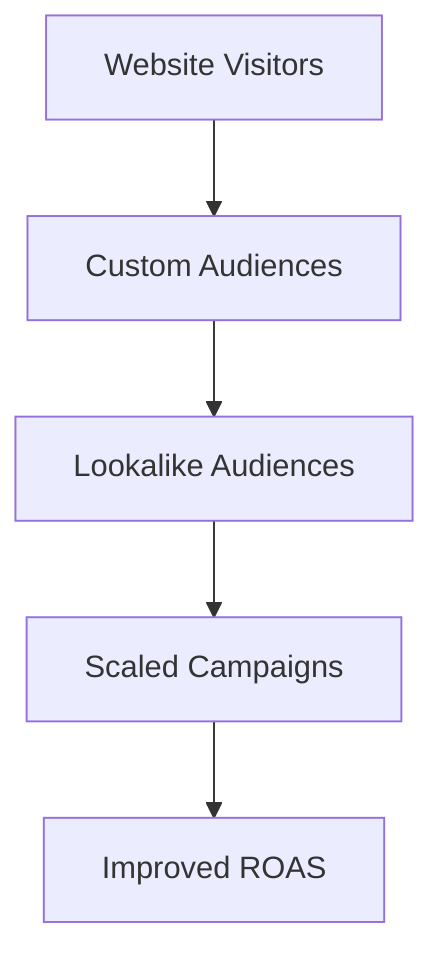

# Lesson 6: Best Practices for Scaling Ads with Pixel Data

## 🎯 Learning Objectives

By the end of this lesson, you will be able to:
- Build effective custom audiences
- Create lookalike audiences for scaling
- Optimize ad campaigns with pixel data
- Implement advanced tracking strategies
- Measure and improve campaign performance
- Scale your advertising budget effectively

## 🎯 Audience Building Strategies

### Custom Audiences from Pixel Data



### 1. Website Custom Audiences

**All Website Visitors (30 days)**
- **Use case**: Brand awareness, retargeting
- **Size**: Usually largest audience
- **Best for**: Top-of-funnel campaigns

**Product Viewers (7 days)**
- **Use case**: Product-specific retargeting
- **Size**: Medium audience
- **Best for**: Product promotion campaigns

**Add to Cart (7 days)**
- **Use case**: Cart abandonment recovery
- **Size**: Smaller, high-intent audience
- **Best for**: Conversion-focused campaigns

**Purchase (30 days)**
- **Use case**: Customer retention, upsells
- **Size**: Smallest, highest value
- **Best for**: Loyalty and cross-sell campaigns

### 2. Value-Based Audiences

```typescript
// Track customer value for audience segmentation
interface CustomerValue {
  totalSpent: number;
  orderCount: number;
  lastPurchaseDate: string;
  averageOrderValue: number;
}

const trackCustomerValue = (customerValue: CustomerValue) => {
  trackEvent('Purchase', {
    value: customerValue.totalSpent,
    currency: 'USD',
    custom_parameters: {
      customer_lifetime_value: customerValue.totalSpent,
      order_count: customerValue.orderCount,
      average_order_value: customerValue.averageOrderValue
    }
  });
};
```

**High-Value Customers (90 days)**
- **Criteria**: Customers who spent >$200
- **Use case**: Premium product promotion
- **Strategy**: Higher budget, premium creative

**Frequent Buyers (60 days)**
- **Criteria**: 3+ purchases in 60 days
- **Use case**: New product launches
- **Strategy**: Early access, exclusive offers

## 🔍 Lookalike Audience Creation

### 1. Source Audience Selection

**Best Source Audiences (in order of effectiveness):**

1. **Purchase Events (30 days)**
   - Highest quality source
   - Best for conversion campaigns
   - Recommended size: 1,000+ people

2. **Add to Cart Events (30 days)**
   - High-intent users
   - Good for awareness campaigns
   - Recommended size: 1,000+ people

3. **Website Visitors (30 days)**
   - Larger audience
   - Good for reach campaigns
   - Recommended size: 10,000+ people

### 2. Lookalike Audience Configuration

```typescript
// Track audience quality metrics
interface AudienceMetrics {
  sourceAudienceSize: number;
  lookalikePercentage: number;
  estimatedReach: number;
  qualityScore: 'excellent' | 'good' | 'fair' | 'poor';
}

const calculateAudienceQuality = (metrics: AudienceMetrics): string => {
  if (metrics.sourceAudienceSize >= 1000 && metrics.lookalikePercentage <= 3) {
    return 'excellent';
  } else if (metrics.sourceAudienceSize >= 500 && metrics.lookalikePercentage <= 5) {
    return 'good';
  } else if (metrics.sourceAudienceSize >= 100 && metrics.lookalikePercentage <= 10) {
    return 'fair';
  } else {
    return 'poor';
  }
};
```

**Lookalike Percentage Guidelines:**
- **1%**: Highest quality, smallest reach
- **2-3%**: Balanced quality and reach
- **5%**: Larger reach, good quality
- **10%**: Maximum reach, lower quality

## 📊 Campaign Optimization Strategies

### 1. Campaign Structure for Scaling

```typescript
// Campaign hierarchy for scaling
interface CampaignStructure {
  campaign: {
    objective: 'CONVERSIONS' | 'TRAFFIC' | 'BRAND_AWARENESS';
    budget: number;
    optimization: 'CONVERSIONS' | 'VALUE';
  };
  adSets: {
    audience: string;
    budget: number;
    placement: string[];
    optimization: string;
  }[];
  ads: {
    creative: string;
    copy: string;
    callToAction: string;
  }[];
}
```

**Scaling Campaign Structure:**

1. **Campaign Level**
   - **Objective**: Conversions
   - **Budget**: Start with $50-100/day
   - **Optimization**: Conversions or Value

2. **Ad Set Level**
   - **Audience**: 1% Lookalike + Interest targeting
   - **Budget**: 70% of campaign budget
   - **Placement**: Automatic placements

3. **Ad Level**
   - **Creative**: 3-5 variations
   - **Copy**: A/B test different angles
   - **CTA**: Test different buttons

### 2. Budget Scaling Strategy

```typescript
// Budget scaling algorithm
interface BudgetScaling {
  currentSpend: number;
  currentROAS: number;
  targetROAS: number;
  maxDailyBudget: number;
  scalingFactor: number;
}

const calculateScalingBudget = (metrics: BudgetScaling): number => {
  const { currentSpend, currentROAS, targetROAS, maxDailyBudget, scalingFactor } = metrics;
  
  if (currentROAS >= targetROAS) {
    // Scale up budget
    const newBudget = Math.min(currentSpend * scalingFactor, maxDailyBudget);
    return newBudget;
  } else {
    // Maintain or reduce budget
    return currentSpend;
  }
};
```

**Scaling Rules:**
- **Scale up**: When ROAS > target for 3+ days
- **Scale down**: When ROAS < target for 3+ days
- **Maximum increase**: 20% per day
- **Maximum decrease**: 50% per day

## 🎯 Advanced Tracking Strategies

### 1. Customer Lifetime Value Tracking

```typescript
// Track CLV for better optimization
interface CustomerLifetimeValue {
  customerId: string;
  totalValue: number;
  orderCount: number;
  firstPurchaseDate: string;
  lastPurchaseDate: string;
  averageOrderValue: number;
}

const trackCLV = (clv: CustomerLifetimeValue) => {
  trackEvent('Purchase', {
    value: clv.totalValue,
    currency: 'USD',
    custom_parameters: {
      customer_id: clv.customerId,
      lifetime_value: clv.totalValue,
      order_count: clv.orderCount,
      days_since_first_purchase: calculateDaysSince(clv.firstPurchaseDate),
      average_order_value: clv.averageOrderValue
    }
  });
};
```

### 2. Product Performance Tracking

```typescript
// Track product-specific metrics
interface ProductPerformance {
  productId: string;
  category: string;
  price: number;
  views: number;
  addToCarts: number;
  purchases: number;
  conversionRate: number;
}

const trackProductPerformance = (product: ProductPerformance) => {
  // Track product view
  trackEvent('ViewContent', {
    content_ids: [product.productId],
    content_type: 'product',
    content_category: product.category,
    value: product.price,
    currency: 'USD',
    custom_parameters: {
      product_performance_score: calculatePerformanceScore(product)
    }
  });
};
```

### 3. Seasonal and Event Tracking

```typescript
// Track seasonal events and promotions
const trackSeasonalEvent = (eventType: string, parameters: any) => {
  trackEvent('CustomEvent', {
    event_name: eventType,
    ...parameters,
    custom_parameters: {
      season: getCurrentSeason(),
      holiday: getCurrentHoliday(),
      promotion_active: isPromotionActive()
    }
  });
};

// Examples:
trackSeasonalEvent('BlackFriday', { discount_percentage: 30 });
trackSeasonalEvent('HolidaySeason', { gift_wrapping: true });
trackSeasonalEvent('BackToSchool', { student_discount: true });
```

## 📈 Performance Measurement

### 1. Key Metrics to Track

```typescript
// Performance metrics interface
interface PerformanceMetrics {
  // Campaign metrics
  impressions: number;
  clicks: number;
  spend: number;
  conversions: number;
  
  // Calculated metrics
  ctr: number; // Click-through rate
  cpc: number; // Cost per click
  cpa: number; // Cost per acquisition
  roas: number; // Return on ad spend
  
  // Pixel-specific metrics
  pixelEvents: number;
  conversionRate: number;
  attributionWindow: string;
}

const calculateMetrics = (rawData: any): PerformanceMetrics => {
  return {
    impressions: rawData.impressions,
    clicks: rawData.clicks,
    spend: rawData.spend,
    conversions: rawData.conversions,
    ctr: (rawData.clicks / rawData.impressions) * 100,
    cpc: rawData.spend / rawData.clicks,
    cpa: rawData.spend / rawData.conversions,
    roas: (rawData.conversion_value / rawData.spend) * 100
  };
};
```

### 2. Attribution and Conversion Windows

**Attribution Windows:**
- **1-day click**: Immediate conversions
- **7-day click**: Short-term conversions
- **28-day click**: Long-term conversions
- **1-day view**: View-through conversions

**Best Practices:**
- Use 7-day click for most campaigns
- Use 1-day click for time-sensitive offers
- Use 28-day click for brand awareness campaigns

### 3. A/B Testing Framework

```typescript
// A/B testing for pixel optimization
interface ABTest {
  testId: string;
  variant: 'A' | 'B';
  audience: string;
  creative: string;
  budget: number;
  startDate: string;
  endDate: string;
}

const trackABTest = (test: ABTest, eventName: string, parameters: any) => {
  trackEvent(eventName, {
    ...parameters,
    custom_parameters: {
      ab_test_id: test.testId,
      ab_test_variant: test.variant,
      ab_test_audience: test.audience
    }
  });
};
```

## 🚀 Scaling Strategies

### 1. Horizontal Scaling

**Expand to New Audiences:**
- Create lookalikes from different source audiences
- Test interest-based targeting
- Expand to new demographics
- Test different age groups

**Expand to New Placements:**
- Test Instagram Reels
- Try Facebook Stories
- Test Messenger ads
- Experiment with Audience Network

### 2. Vertical Scaling

**Increase Budget Gradually:**
- Start with 20% increases
- Monitor performance for 3-5 days
- Scale successful campaigns
- Pause underperforming ad sets

**Optimize for Higher Value:**
- Use Value optimization
- Track customer lifetime value
- Optimize for higher-value conversions
- Implement dynamic product ads

### 3. Creative Scaling

**Creative Testing Framework:**
```typescript
// Creative performance tracking
interface CreativePerformance {
  creativeId: string;
  format: 'image' | 'video' | 'carousel';
  ctr: number;
  cpc: number;
  conversions: number;
  roas: number;
}

const trackCreativePerformance = (creative: CreativePerformance) => {
  trackEvent('CustomEvent', {
    event_name: 'CreativePerformance',
    custom_parameters: {
      creative_id: creative.creativeId,
      creative_format: creative.format,
      creative_ctr: creative.ctr,
      creative_cpc: creative.cpc,
      creative_conversions: creative.conversions,
      creative_roas: creative.roas
    }
  });
};
```

## 🔧 Advanced Optimization Techniques

### 1. Dynamic Product Ads (DPA)

```typescript
// DPA implementation
interface DPAProduct {
  id: string;
  name: string;
  description: string;
  image_url: string;
  url: string;
  price: number;
  currency: string;
  availability: 'in stock' | 'out of stock';
  condition: 'new' | 'used' | 'refurbished';
  category: string;
}

const trackDPAProduct = (product: DPAProduct) => {
  trackEvent('ViewContent', {
    content_ids: [product.id],
    content_type: 'product',
    content_name: product.name,
    content_category: product.category,
    value: product.price,
    currency: product.currency,
    custom_parameters: {
      product_url: product.url,
      product_image_url: product.image_url,
      product_availability: product.availability,
      product_condition: product.condition
    }
  });
};
```

### 2. Retargeting Sequences

```typescript
// Retargeting sequence tracking
interface RetargetingSequence {
  step: number;
  audience: string;
  creative: string;
  delay: number; // days
  objective: string;
}

const trackRetargetingStep = (sequence: RetargetingSequence, eventName: string) => {
  trackEvent(eventName, {
    custom_parameters: {
      retargeting_step: sequence.step,
      retargeting_audience: sequence.audience,
      retargeting_delay_days: sequence.delay,
      retargeting_objective: sequence.objective
    }
  });
};
```

### 3. Cross-Platform Tracking

```typescript
// Cross-platform user identification
interface CrossPlatformUser {
  userId: string;
  email: string;
  phone?: string;
  platforms: ('web' | 'mobile' | 'app')[];
  lastSeen: string;
}

const trackCrossPlatformUser = (user: CrossPlatformUser, eventName: string, parameters: any) => {
  trackEvent(eventName, {
    ...parameters,
    custom_parameters: {
      user_id: user.userId,
      user_email: user.email,
      user_phone: user.phone,
      platforms: user.platforms,
      last_seen: user.lastSeen
    }
  });
};
```

## 📊 Reporting and Analytics

### 1. Custom Dashboard

```typescript
// Performance dashboard data
interface DashboardData {
  dateRange: {
    start: string;
    end: string;
  };
  metrics: {
    totalSpend: number;
    totalConversions: number;
    totalRevenue: number;
    roas: number;
    cpa: number;
  };
  topPerformingAudiences: Array<{
    audience: string;
    spend: number;
    conversions: number;
    roas: number;
  }>;
  topPerformingCreatives: Array<{
    creative: string;
    ctr: number;
    cpc: number;
    conversions: number;
  }>;
}
```

### 2. Automated Reporting

```typescript
// Automated performance reports
const generatePerformanceReport = (data: DashboardData) => {
  const report = {
    summary: {
      totalSpend: data.metrics.totalSpend,
      totalConversions: data.metrics.totalConversions,
      roas: data.metrics.roas,
      cpa: data.metrics.cpa
    },
    recommendations: generateRecommendations(data),
    alerts: generateAlerts(data)
  };
  
  return report;
};
```

## 📋 Scaling Checklist

Before scaling your campaigns, ensure you have:

- ✅ Pixel properly implemented and tracking
- ✅ Sufficient data (100+ conversions)
- ✅ Profitable campaigns running
- ✅ Multiple audience segments tested
- ✅ Creative variations tested
- ✅ Budget scaling strategy defined
- ✅ Performance monitoring in place
- ✅ Attribution windows configured
- ✅ A/B testing framework ready
- ✅ Reporting dashboard set up

## 🚀 Next Steps

You've now completed the comprehensive Meta Pixel integration course! In the final section, we'll build a complete demo project that showcases everything you've learned.

---

**Ready for the Demo Project?** [Real-world Demo with Functional Next.js Shop →](../demo-project/README.md)
